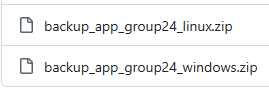
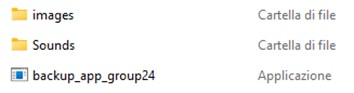
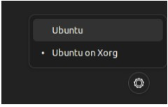
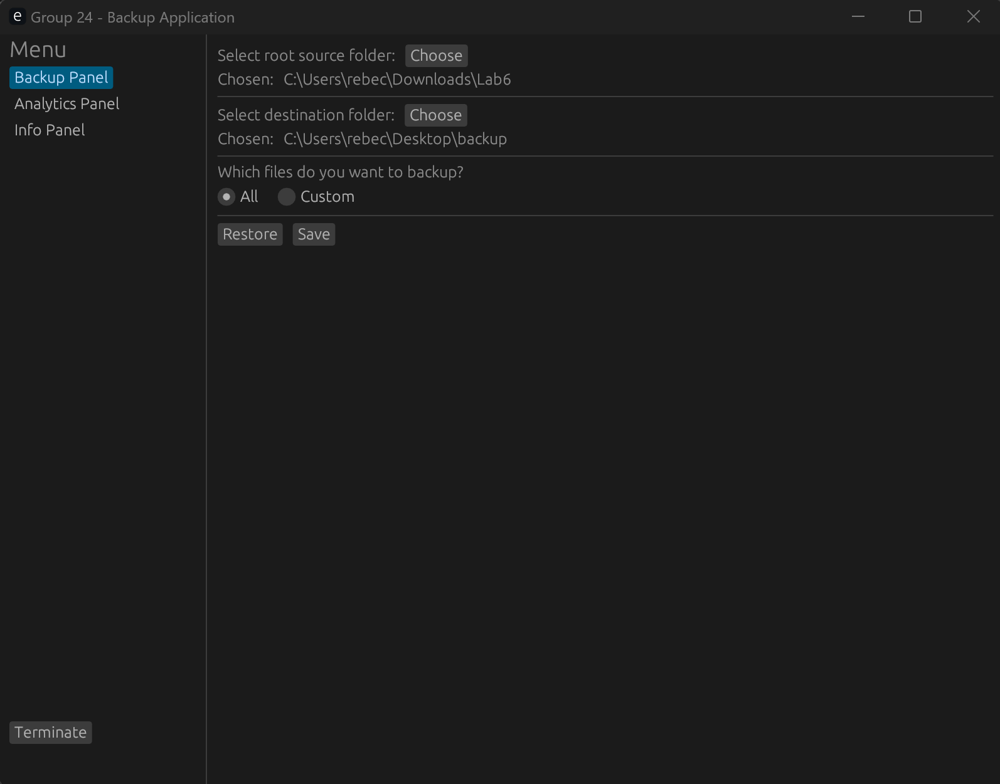
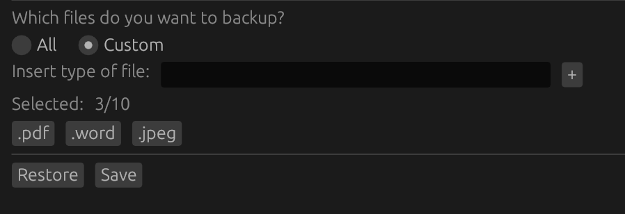
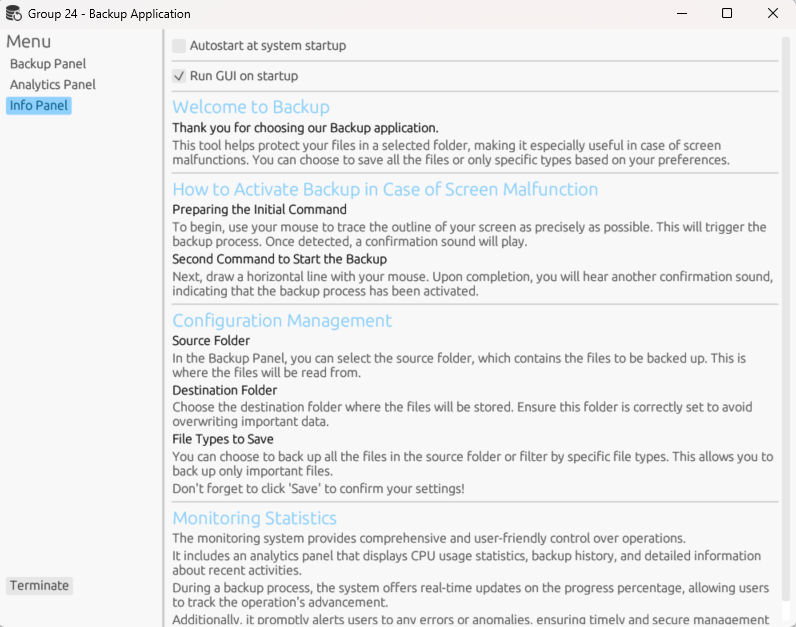
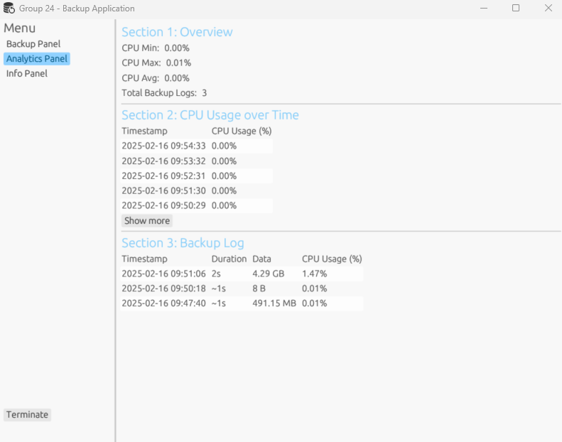
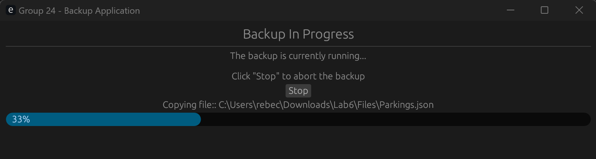
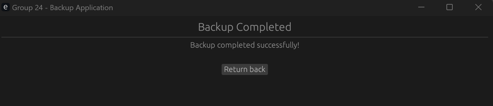

# Backup di Emergenza
Un'applicazione per PC progettata per eseguire backup in caso di schermo inutilizzabile. 
L'utente può attivare il backup tramite un comando grafico tracciato con il mouse, senza la necessità di interagire con una GUI tradizionale.
Supporta anche diverse modalità di backup, inclusi file di tipo specifico e intere cartelle.

## Caratteristiche
L'applicazione offre le seguenti funzionalità:

- **Backup tramite comando grafico**: L'utente può avviare un backup tracciando un rettangolo lungo i bordi dello schermo con il mouse e confermare successivamente l'azione tracciando una riga orizzontale.
    Una volta riconosciuti i due comandi, il programma avvia il processo di backup.

- **Feedback sonoro**: Il programma riproduce suoni nelle seguenti fasi:
  - Suono di attivazione al riconoscimento del comando di backup.
  - Suono di inizio backup.
  - Suono di conferma al completamento del backup.
  - Suono di errore durante il backup.

- **Finestra di conferma con barra di progresso**: Dopo l'attivazione del backup, viene visualizzata una finestra di conferma che segnala che il processo è in corso. All'interno della finestra, è presente una barra di progresso che mostra in tempo reale l'avanzamento del backup, permettendo all'utente di monitorare facilmente il completamento dell'operazione.

- **Selezione del contenuto del backup**: L'utente può scegliere tra diverse opzioni di backup:
  - Backup dell'intero contenuto di una cartella (anche contenente più sottocartelle).
  - Backup di file specifici, selezionando tipi di file come pdf, jpeg, png, ecc.
  - Possibilità di combinare più tipi di file in un singolo backup.

- **Monitoraggio e aggiornamenti in tempo reale**: Il sistema offre un pannello che fornisce:
  - Statistiche di utilizzo della CPU mostrando le statistiche minime, massime e medie dell'uso della CPU, permettendo un'analisi delle prestazioni del sistema in tempo reale.
  - Storico delle operazioni di backup visualizzando i log storici dei backup, con informazioni su durata, dati trasferiti e uso della CPU, consentendo di monitorare l'andamento delle operazioni passate e accedere ai dettagli più significativi.

- **Avvio automatico con il sistema**: Attraverso l'Info Panel, è possibile selezionare una casella per configurare l'avvio automatico dell'applicazione all'accensione del sistema, garantendo che il software sia operativo sin dall'inizio e sempre pronto per eseguire backup.

- **Avvio automatico della GUI**: Attraverso l'Info Panel, è possibile selezionare una casella per configurare l'avvio automatico dello user panel, in modo che ogni volta che si lancia l'applicazione compare anche la GUI.

- **Notifiche di errore e anomalie**: L'applicazione avvisa immediatamente l'utente di eventuali errori o anomalie durante l'esecuzione del backup.

## Compatibilità
L'applicazione è compatibile con i seguenti sistemi operativi:
- Windows 10/11
- Linux (Sviluppato e testato su macchina virtuale con Ubuntu)

## Download
Per installare l'applicazione, segui questi passaggi:
1. Download: dal repository github andare nella cartella download/ e scegliere la versione per il sistema operativo desiderato.
    
2. Estrarre il .zip scaricato
  - Una volta estratto il .zip il programma è pronto all'uso, basterà lanciare l'applicazione nella cartella estratta.
    
  - **Nota**: Spostare l’eseguibile dalla cartella di installazione potrebbe compromettere il corretto funzionamento del programma.
  - Linux
    - impostare Ubuntu Xorg all'avvio del sistema opearativo.
     

## Schermate
Ecco alcune schermate dell'applicazione:

Nella schermata di configurazione del backup puoi selezionare la cartella di origine (source folder), quella di destinazione (destination folder) e specificare le estensioni dei file da salvare (ad esempio .txt, .jpg), oppure lasciare 'all' per includere tutti i file.
Premi su "Save" per salvare la configurazione: verrà utilizzata nella procedura di backup.

  - Puoi scegliere "Custom" per specificare manualmente le estensioni da salvare (ad esempio .txt, .jpg)
    

Info Panel fornisce una panoramica generale dell'applicazione e delle sue funzionalità principali.
Puoi decidere se eseguire l'app in background senza mostrare la GUI e/o far partire il programma all'avvio del sistema operativo.

Questa schermata consente di monitorare le performance del sistema e tenere traccia della cronologia dei backup.

Per far partire il backup (anche in caso di malfunzionamento dello schermo) l’utente deve tracciare il contorno dello schermo. Per confermare l'operazione bisogna tracciare un segno orizzontale dopo aver sentito un suono.

Appena avviato il backup, viene mostrata una barra di progresso che indica lo stato dell'operazione, consentendo di monitorare in tempo reale l'avanzamento del processo; inoltre, hai la possibilità di interrompere il backup in qualsiasi momento tramite il bottone stop.

Al termine del backup, viene visualizzata una schermata di conferma che indica il completamento dell'operazione.

Quando la GUI non è visibile l’utente può in ogni momento cliccare sull’eseguibile per mostrarla. 

##

Politecnico di Torino, 16-02-2025

